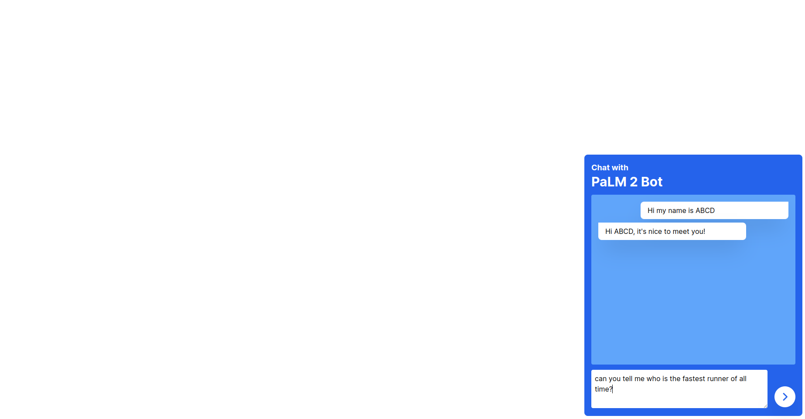
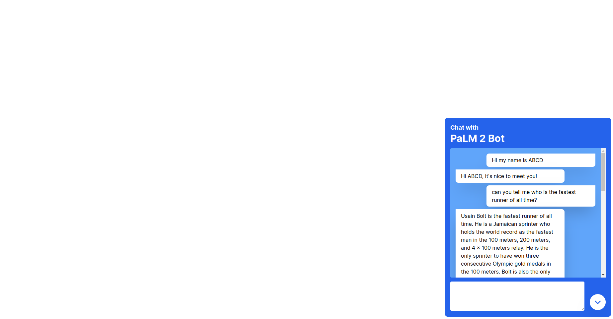
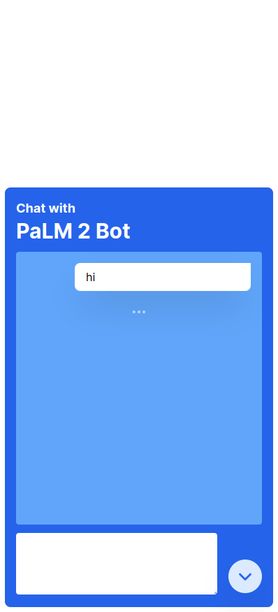
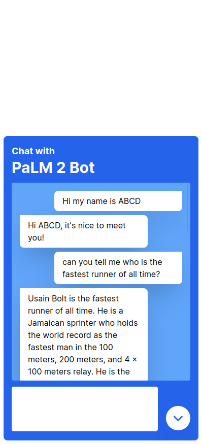

# Chat with PaLM 2 Bot

This is a sample project showing how to use PaLM 2 text generation model to make a chat bot.

<p float="left">
  
  
  
</p>
<p float="left">
  
  
</p>

## Services Used

- PaLM

## Languages, Frameworks and Libraries Used

- Next.js
- Typescript
- Tailwind CSS

## Environment Variables (.env.local)

```sh
LANGUAGE_MODEL_URL
```